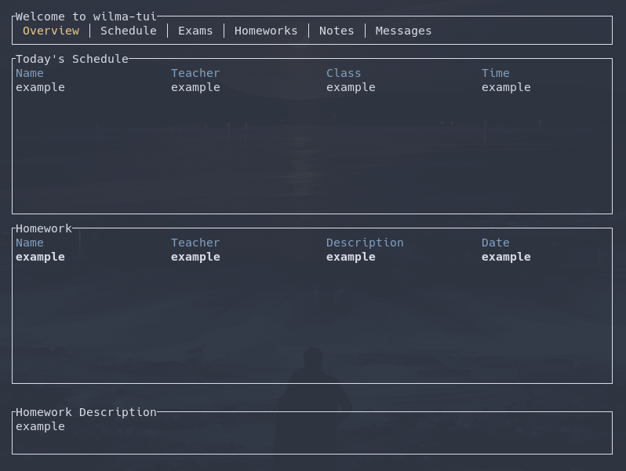

# wilma-tui
A wilma client for terminal.
Only the overview page is implemented right now.

# Installation
```
git clone https://github.com/RitariME/wilma-tui
cd wilma-tui
cargo run
```
# Login wilma
Open `~/.config/wilma-tui/config` with your favorite text editor and insert your wilma credentials and inschool.fi url like this:
```
yourwilma@emailadress.fi
yourwilmapassword
https://your.inschool.fi
```
